# HRlynx

<p align="center">
  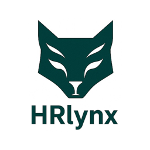
</p>

<p align="center">
  <strong>AI-powered HR companion</strong> for news, personas, and practical guidance.<br/>
  Cross-platform Flutter app for <strong>Google Play</strong> and the <strong>Apple App Store</strong>.
</p>

<p align="center">
  <a href="https://play.google.com/store/apps/details?id=com.lynxova.hrlnyx">Google Play</a>
  ·
  <a href="https://apps.apple.com/us/app/hrlynx/id6752120098">App Store</a>
</p>

HRlynx is a mobile HR product from **Lynxova, LLC**. It delivers daily HR QuickScan™ news, specialty insights, and chat with AI HR personas (recruiting, compliance, compensation, and more). The same codebase ships to Android and iOS.

---

## Overview

This repository is the **HRlynx client app** (Flutter). Users sign in, pick an HR persona, chat with AI (text and voice), read QuickScan news, manage profile and notifications, and subscribe through the store.

| | |
| --- | --- |
| Package / bundle | `com.lynxova.hrlnyx` |
| Platforms | Android (Play Store) and iOS / iPadOS (App Store) |
| State management | **GetX** |
| Subscriptions | **RevenueCat** (`purchases_flutter`) — Apple IAP and Google Play Billing |
| Store plans | Explorer Pro Monthly **$4.99**, Explorer Pro Yearly **$49.99** |

**Team**

- App — Motasim Fuad
- Backend — Rafi
- Dashboard — AL Zinan

---

## Screenshots

Phone screenshots from the **Play Store listing** (Play Console assets):

<p>
  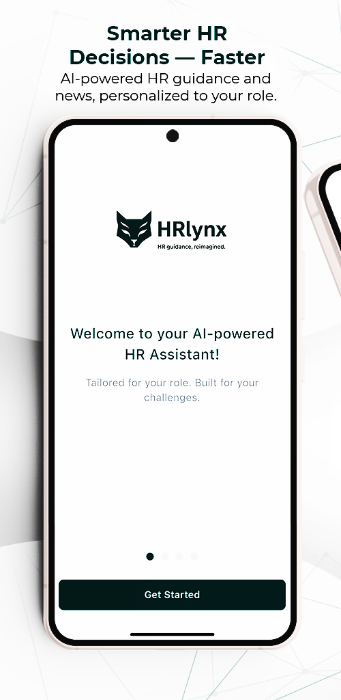
  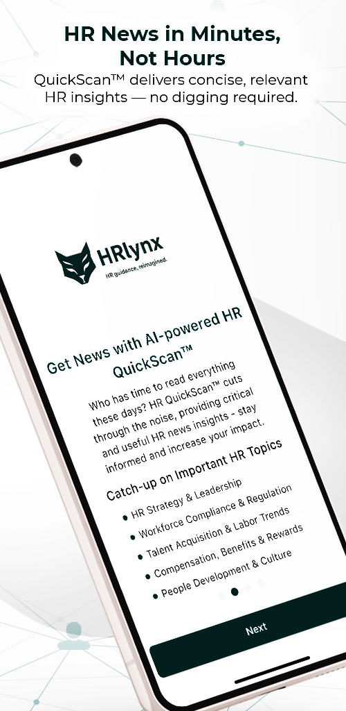
  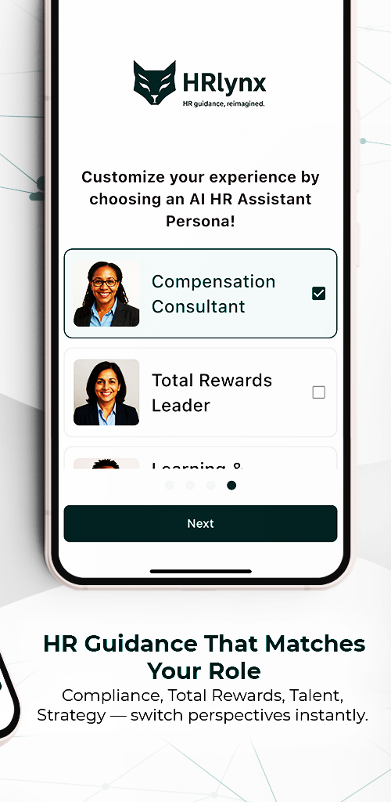
  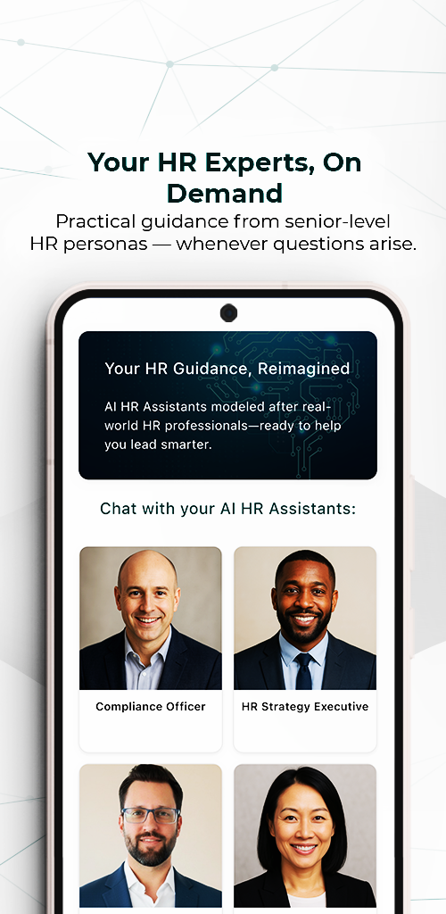
  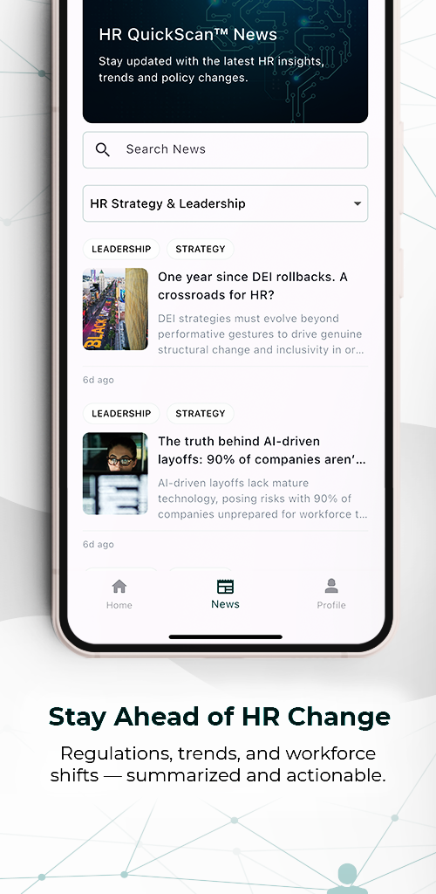
</p>

Phone screenshots from the **App Store**:

<p>
  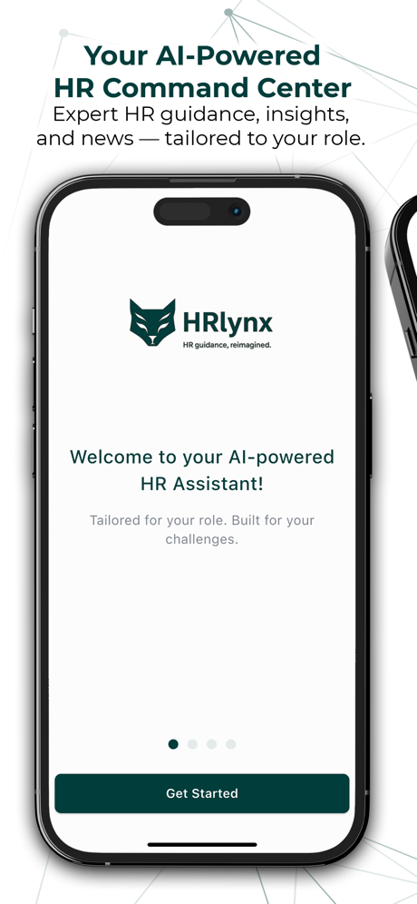
  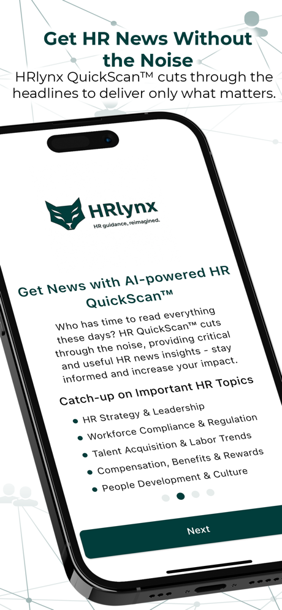
  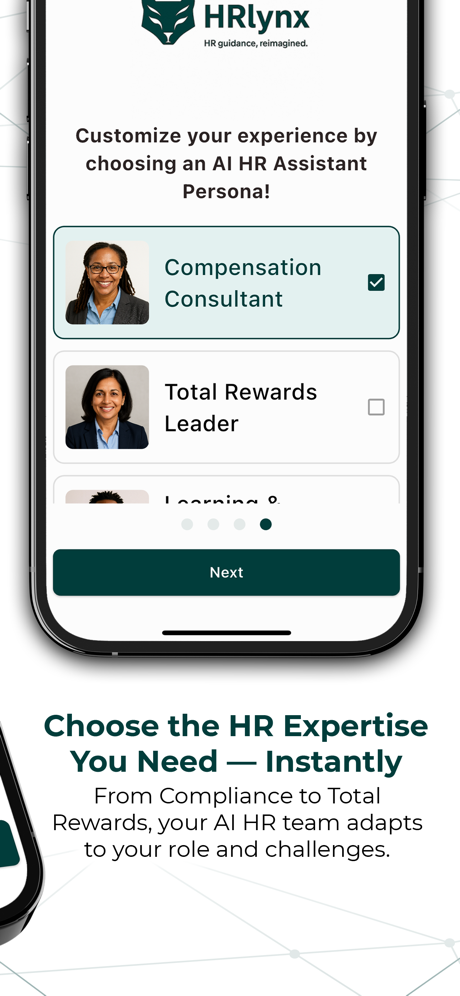
  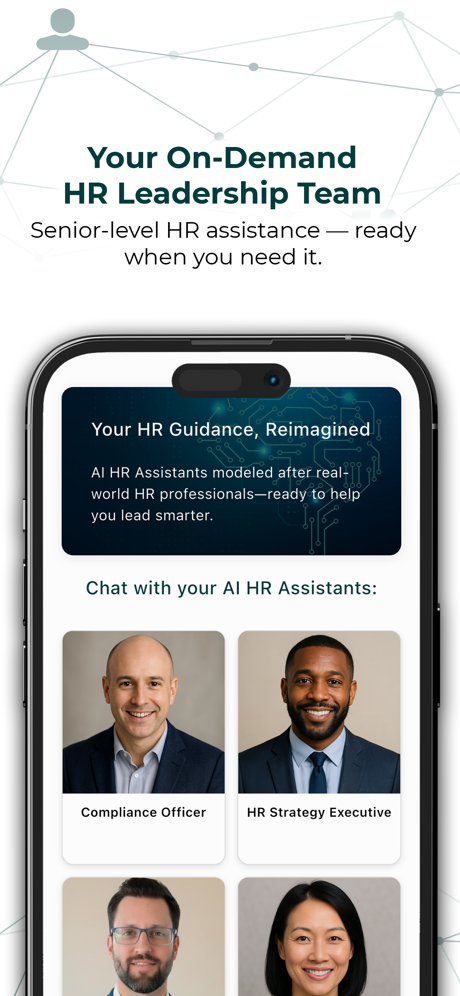
  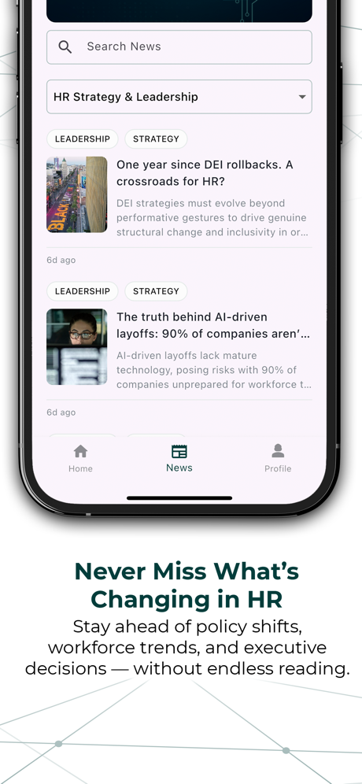
  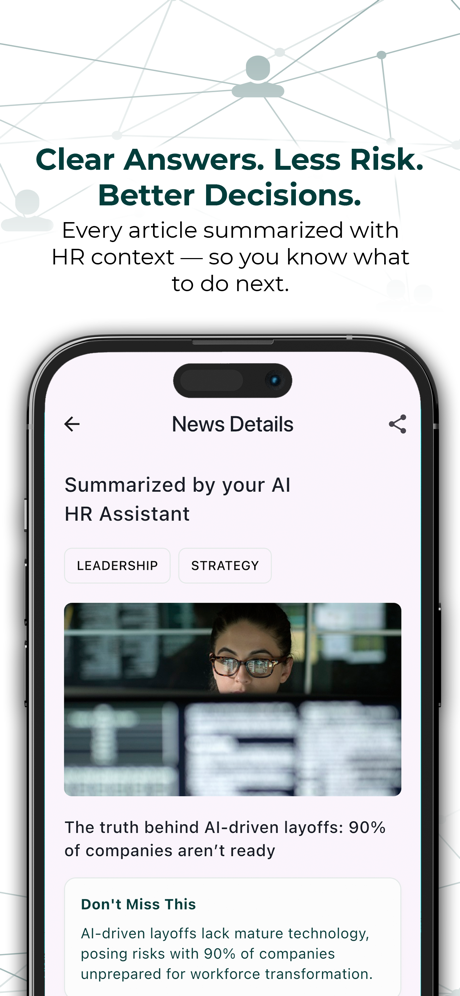
  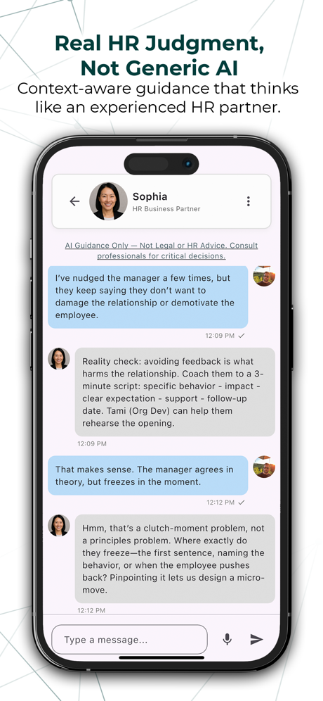
</p>

---

## What the app does

- **Auth** — email sign up / login, OTP, Google Sign-In, Sign in with Apple, biometric unlock, forgot / reset password
- **Onboarding** — select an HR persona
- **Home** — persona grid; access gated by subscription (and admin / client bypass)
- **AI chat** — WebSocket chat, suggestions, session history, voice notes, daily token limit with upgrade prompt
- **News (QuickScan™)** — feed, categories, AI summary, share, affiliate products
- **Notifications** — FCM + in-app notification list
- **Profile** — edit profile, change password, restore purchases, logout, delete account
- **Paywall** — RevenueCat packages mapped to backend plans; purchase and restore on both stores

---

## Tech stack

| Area | What we use |
| --- | --- |
| UI / client | Flutter, Dart |
| State management & routing | **GetX** (`GetxController`, `Obx`, `Get.to` / `Get.put`) |
| HTTP | `http` + `NetworkApiServices` |
| Chat realtime | `web_socket_channel` |
| Subscriptions | **RevenueCat** (`purchases_flutter`) on **Apple** and **Google** |
| Auth / crash / push | Firebase Auth, Crashlytics, Cloud Messaging |
| Social login | `google_sign_in`, `sign_in_with_apple` |
| Local data | `shared_preferences`, `flutter_secure_storage`, `flutter_dotenv` |
| Media | `record` + `audioplayers` (voice), `image_picker`, `cached_network_image`, `flutter_svg` |
| Device | `local_auth`, `permission_handler`, `flutter_local_notifications`, `url_launcher`, `share_plus` |

Cross-platform billing: one RevenueCat SDK. iOS uses App Store In-App Purchases; Android uses Google Play Billing. Entitlements and restore work the same way in the app; the store is chosen by the OS.

---

## App flow (short)

1. Splash checks login token and starts notification / FCM work in the background.
2. Login or sign up (email, Google, or Apple), then subscription check via RevenueCat.
3. Main tabs: **Home** (personas), **News**, **Profile**.
4. Opening a persona starts or reuses a chat session; token limit is kept on the WebSocket service so it survives controller rebuilds.
5. Purchase / restore goes through RevenueCat, then the backend subscription flag is synced.

---

## Links

- [Google Play — HRlynx](https://play.google.com/store/apps/details?id=com.lynxova.hrlnyx)
- [App Store — HRlynx](https://apps.apple.com/us/app/hrlynx/id6752120098)
- [Terms of Use](https://api.hrlynx.ai/terms-conditions/)
- [Privacy Policy](https://api.hrlynx.ai/privacy-policy/)
- [Support](https://api.hrlynx.ai/about-us/)

---

## Run locally

```bash
flutter pub get
flutter run
```

Requires a valid `.env` (API, RevenueCat, Firebase) and platform Firebase / Google / Apple configs already in the project.
